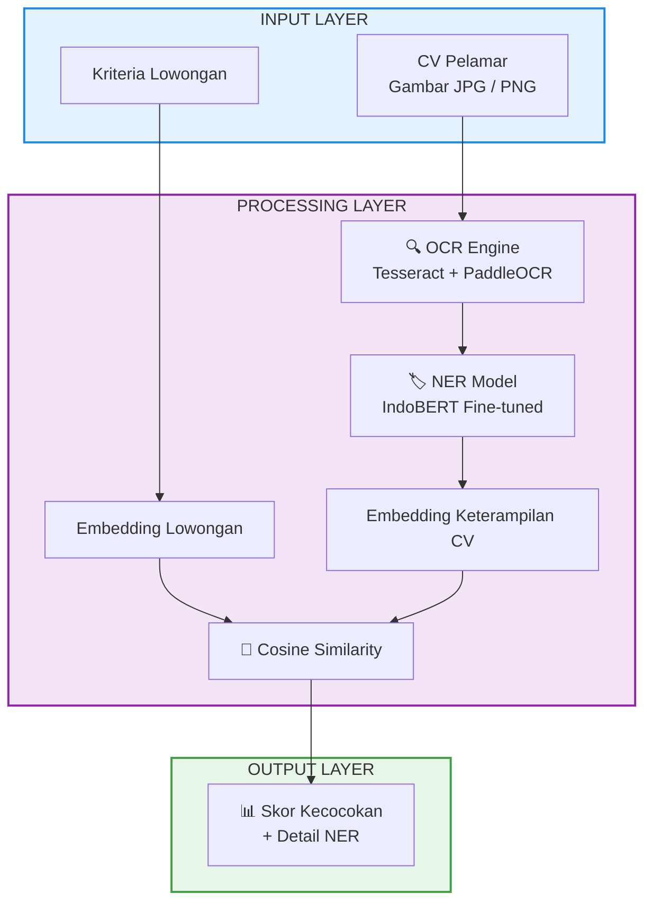

<p align="center">
  
  
  
  
</p>

<h1 align="center">🧠 RecruitAI — Automated Job-Candidate Matching System with NLP</h1>

<p align="center">
  <strong>Sistem Rekrutmen Cerdas Berbasis AI untuk Mencocokkan CV Kandidat dengan Kriteria Lowongan Kerja</strong>
</p>

<p align="center">
  <em>Proyek Mata Kuliah Natural Language Processing (NLP) — Semester 6, 2026</em>
</p>

---

## 📋 Deskripsi Proyek

**RecruitAI** adalah sistem berbasis web yang mengotomasi proses pencocokan antara CV pelamar dengan kriteria lowongan kerja menggunakan teknologi **Natural Language Processing (NLP)**. Sistem ini menggabungkan tiga pipeline AI utama:

1. **OCR (Optical Character Recognition)** — Mengekstrak teks dari gambar CV
2. **NER (Named Entity Recognition)** — Mengidentifikasi entitas keterampilan dari teks
3. **Semantic Matching** — Menghitung kecocokan semantik antara keterampilan kandidat dengan persyaratan lowongan

---

## ✨ Fitur Utama

| Fitur | Deskripsi |
|-------|-----------|
| 🔍 **Dual OCR Engine** | Ensemble Tesseract v5 + PaddleOCR untuk akurasi ekstraksi teks maksimal |
| 🏷️ **NER Kustom** | Model IndoBERT yang di-fine-tune untuk mengenali entitas `KETERAMPILAN` dari teks bahasa Indonesia |
| 🧬 **Semantic Similarity** | Sentence Transformer (`paraphrase-multilingual-MiniLM-L12-v2`) menghitung cosine similarity antar embedding |
| 📊 **Skor Kecocokan** | Persentase kecocokan ditampilkan dengan gauge chart animasi |
| 🎨 **UI/UX** | Antarmuka dark-mode dengan glassmorphism, animasi gradient, dan Lottie animations |
| 📄 **Pipeline Visual** | Visualisasi step-by-step proses (Upload → OCR → NER → Matching → Hasil) |

---

## 🏗️ Arsitektur Sistem



---

## 🛠️ Tech Stack

| Komponen | Teknologi |
|----------|-----------|
| **Framework Web** | Streamlit |
| **OCR** | Tesseract v5, PaddleOCR |
| **NER** | IndoBERT (fine-tuned), HuggingFace Transformers |
| **Embedding** | Sentence-Transformers (`paraphrase-multilingual-MiniLM-L12-v2`) |
| **Similarity** | Cosine Similarity |
| **Image Processing** | OpenCV, Pillow |
| **Bahasa** | Python 3.10+ |

---

## 📁 Struktur Proyek

```
📦 Automated Job-Candidate Matching System with NLP
├── 📄 app.py                          # Aplikasi utama Streamlit
├── 📂 modules/
│   └── 📄 ocr_engine.py              # Modul OCR (Tesseract + PaddleOCR)
├── 📂 models/
│   └── 📂 indobert-ner-rekrutmen-final/  # Model NER hasil fine-tuning
│       ├── config.json
│       ├── model.safetensors
│       ├── tokenizer.json
│       └── tokenizer_config.json
├── 📂 .streamlit/
│   └── 📄 config.toml                # Konfigurasi tema Streamlit
├── 📄 fine_tuning_ner.ipynb           # Notebook fine-tuning model NER
├── 📄 deploy_app.ipynb               # Notebook deployment (Colab)
├── 📄 dataset_rekrutmen_sintetis.json # Dataset sintetis untuk training
├── 📄 .gitignore
└── 📄 README.md
```

---

## 🚀 Cara Menjalankan

### Prasyarat

- Python 3.10 atau lebih baru
- Tesseract OCR terinstall ([Download](https://github.com/tesseract-ocr/tesseract))
- Model NER hasil fine-tuning (jalankan `fine_tuning_ner.ipynb` terlebih dahulu)

### Instalasi

1. **Clone repository**
   ```bash
   git clone https://github.com/YOUR_USERNAME/Automated-Job-Candidate-Matching-System-with-NLP.git
   cd Automated-Job-Candidate-Matching-System-with-NLP
   ```

2. **Buat virtual environment**
   ```bash
   python -m venv .venv
   
   # Windows
   .\.venv\Scripts\activate
   
   # Linux/Mac
   source .venv/bin/activate
   ```

3. **Install dependencies**
   ```bash
   pip install streamlit transformers sentence-transformers paddlepaddle paddleocr pytesseract opencv-python streamlit-lottie
   ```

4. **Siapkan model NER**
   
   Jalankan notebook `fine_tuning_ner.ipynb` di Google Colab untuk mendapatkan model `indobert-ner-rekrutmen-final`, lalu letakkan di folder `models/`.

5. **Jalankan aplikasi**
   ```bash
   streamlit run app.py
   ```

6. **Buka browser** di `http://localhost:8501`

---

## 📖 Cara Penggunaan

1. **Masukkan Kriteria Lowongan** — Tuliskan skill dan pengalaman yang dicari pada kolom teks
2. **Upload CV** — Upload gambar scan CV pelamar (format JPG/PNG)
3. **Klik "Proses"** — Sistem akan menjalankan pipeline OCR → NER → Semantic Matching
4. **Lihat Hasil** — Skor kecocokan ditampilkan beserta detail keterampilan yang terdeteksi

---

## 🧪 Pipeline AI

### 1. OCR Engine (Dual Engine)
Sistem menggunakan **dua mesin OCR** secara bersamaan:
- **Tesseract v5** — OCR open-source dengan dukungan bahasa Indonesia (`ind`) dan Inggris (`eng`)
- **PaddleOCR** — OCR berbasis deep learning dari Baidu dengan angle classification

Hasil kedua engine digabungkan (*ensemble*) untuk memaksimalkan akurasi ekstraksi teks.

### 2. Named Entity Recognition (NER)
Model **IndoBERT** di-fine-tune menggunakan dataset rekrutmen sintetis untuk mengenali entitas:
- **KETERAMPILAN** — Skill teknis dan non-teknis (contoh: Python, Machine Learning, Komunikasi)

### 3. Semantic Matching
Menggunakan **Sentence Transformer** (`paraphrase-multilingual-MiniLM-L12-v2`) untuk:
- Mengubah teks kriteria lowongan menjadi vektor embedding
- Mengubah keterampilan yang diekstrak dari CV menjadi vektor embedding
- Menghitung **Cosine Similarity** antara kedua vektor

---

## 👥 Anggota Tim

<table>
  <tr>
    <th>Nama</th>
    <th>NPM</th>
  </tr>
  <tr>
    <td><strong>Yafi Hidayatullah</strong></td>
    <td><code>2308107010059</code></td>
  </tr>
  <tr>
    <td><strong>Muhammad Azani Irvand</strong></td>
    <td><code>2308107010026</code></td>
  </tr>
  <tr>
    <td><strong>Bunga Rasikhah Haya</strong></td>
    <td><code>2308107010010</code></td>
  </tr>
</table>

---

## 📜 Lisensi

Proyek ini dibuat untuk UAS mata kuliah **Natural Language Processing (NLP)** Semester 6.

---

<p align="center">
  Dibuat menggunakan <strong>Python</strong>, <strong>IndoBERT</strong>, dan <strong>Streamlit</strong>
</p>
